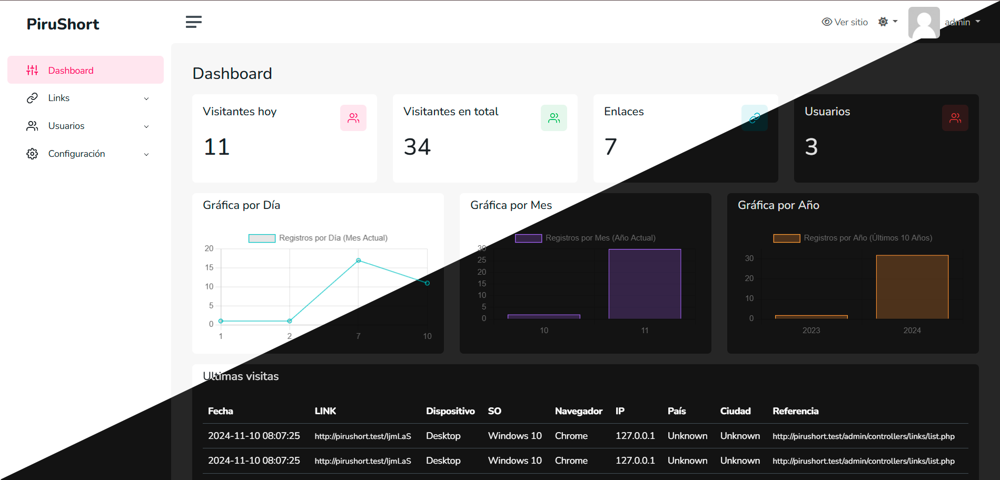

ShortPHPirulug
==============

ShortPHPirulug es un acortador de enlaces desarrollado en PHP y MySQL. Este sistema permite almacenar enlaces largos, acortarlos y redirigir a los usuarios a la URL original de forma rápida y sencilla.

Características
--------------
- Acortar enlaces personalizados y almacenarlos en la base de datos.
- Redirección automática a la URL original desde el enlace acortado.
- Interfaz sencilla para gestionar enlaces.

Requisitos
----------
- PHP >= 7.4
- Servidor web (Apache, Nginx, etc.)
- Base de datos MySQL

Instalación
-----------
1. Sube el proyecto a tu servidor o ejecuta localmente en tu servidor web.
2. Accede a la interfaz de instalación desde tu navegador:
   - Abre el navegador y visita: `http://localhost/ShortPHPirulug/install` o `http://tudominio.com/install` si lo instalas en un servidor remoto.
   
3. La interfaz gráfica te guiará a través del proceso de instalación:
   - Configura la base de datos (nombre, usuario y contraseña).
   - El sistema creará las tablas necesarias automáticamente.
   - Asegúrate de tener las credenciales correctas para la base de datos.
   
4. Una vez completada la instalación, podrás acceder a la interfaz principal y comenzar a acortar enlaces.

Uso
---
1. Accede a la interfaz principal y agrega un enlace en el formulario.
2. El sistema generará una URL corta que puedes compartir.
3. Al ingresar a la URL corta, el usuario será redirigido automáticamente a la URL original almacenada.

Estructura del Proyecto
-----------------------

```bash
ShortPHPirulug/
├── config.php 
├── index.php          
├── link.php 
├── admin/              
├──── index.php              
├──── core.php              
├──── functions.php             
├── libs/             
└── assets/          
```

Contribuir
----------
Las contribuciones son bienvenidas. Para contribuir:

1. Haz un fork del repositorio.
2. Crea una nueva rama (`git checkout -b feature-nueva-funcionalidad`).
3. Realiza tus cambios y haz un commit (`git commit -am 'Añadir nueva funcionalidad'`).
4. Envía tu rama (`git push origin feature-nueva-funcionalidad`).
5. Crea un Pull Request para revisión.

Licencia
--------
Este proyecto está bajo la licencia MIT - consulta el archivo LICENSE para más detalles.

Desarrollado con ❤️ por Pirulug
